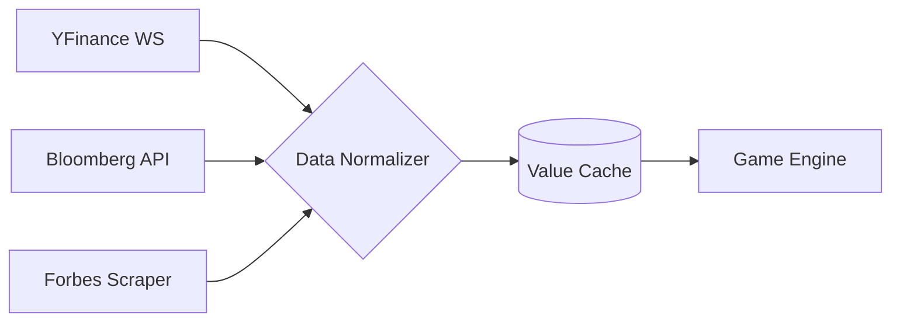

# T   export this in markdown

Absolutely! Here’s your API architecture for "Market Minds" exported in **Markdown** format, ready for documentation or sharing with your development team.

---

# Market Minds API Architecture

## Executive Summary

The "Market Minds" game concept introduces a complex interplay of real-time player interactions, dynamic data integration, and psychological gameplay elements. This document outlines a comprehensive API architecture designed to support the game's multifaceted requirements, balancing real-time responsiveness with robust data management.

---

## 1. Game Session Management API

### Endpoint Structure

```http
POST /api/v1/games
GET /api/v1/games/{gameId}
PATCH /api/v1/games/{gameId}/state
```

Implements finite state machine patterns to manage game lifecycle:

- **Lobby State**: Player joining through invitation codes
- **Active State**: Round progression and real-time interactions
- **Paused State**: Host interventions and rule modifications
- **Completed State**: Final scoring and leaderboard updates


### Host Authority Delegation

```typescript
interface HostPrivileges {
  profileSelection: boolean;
  contextReveal: boolean;
  scoringOverrides: boolean;
  roundControl: boolean;
}
```

Implements OAuth2 token-based authorization with RBAC (Role-Based Access Control) to enforce host privileges while allowing temporary privilege delegation during host rotation scenarios.

---

## 2. Dynamic Data Integration Layer

### Real-Time Market Data Pipeline



- Market cap/net worth normalization using geometric mean aggregation
- Cache strategy: TTL=15s with stale-while-revalidate
- Fallback mechanism to historical data during API outages


### Contextual Hint Generation Service

```python
def generate_hint(profile_id: str, mode: HintMode) -> str:
    news = perplexity_api.fetch_news(profile_id)
    embeddings = nlp_model.encode(news)
    cluster = KMeans(n_clusters=3).fit(embeddings)
    return template_engine.render(cluster.centeroids[mode.value])
```

Leverages Perplexity's NLP API with custom clustering to generate:

- **Neutral Hints**: Factual business developments
- **Positive Spin**: Growth-oriented narratives
- **Red Herrings**: Misleading contextual information

---

## 3. Real-Time Gameplay API

### WebSocket Protocol Design

```json
{
  "action": "guess_submit",
  "payload": {
    "gameId": "a3f8b",
    "round": 4,
    "value": 15200000000,
    "confidence": 0.85
  },
  "timestamp": 1678904512
}
```

- Binary protocol buffers for state synchronization
- 250ms heartbeat interval
- Differential updates for score changes
- Priority queues for host reactions


### Host Interaction Endpoints

```http
POST /api/v1/games/{gameId}/reactions
{
  "type": "BLUFF",
  "intensity": 0.7,
  "targetPlayer": "xq42f"
}
```

Psychological impact modeling using logistic regression:

```mathematica
P(guess) = 1 / (1 + e^(-(β0 + β1*reaction + β2*history)))
```


---

## 4. Adaptive Scoring Engine

### Accuracy Calculation Module

```rust
fn calculate_accuracy(guess: f64, actual: f64) -> f64 {
    let error = (guess - actual).abs() / actual;
    1.0 - error.min(1.0)
}
```


### Rule-Based Scoring Service

```java
public class ScoringEngine {
  private List<ScoringRule> rules;

  public ScoreResult evaluate(Guess guess) {
    return rules.stream()
        .map(rule -> rule.apply(guess))
        .reduce(ScoreResult::merge)
        .orElseThrow();
  }
}
```

Rule types include:

- Distance-based accuracy (Euclidean norm)
- Temporal bonuses (early submission rewards)
- Psychological multipliers (host reaction impacts)

---

## 5. Player Management System

### Progressive Profiling Endpoints

```http
POST /api/v1/players/{playerId}/preferences
{
  "specializations": ["TECH", "CELEBRITIES"],
  "learningFactor": 0.65,
  "riskProfile": "AGGRESSIVE"
}
```

Personalizes:

- Difficulty curves
- Profile suggestions
- Tutorial pacing


### Skill-Based Matchmaking

```sql
SELECT * FROM players
WHERE skill BETWEEN :min AND :max
  AND preferences @> '{"themes": ["STARTUPS"]}'
ORDER BY last_online DESC
LIMIT 7;
```


---

## 6. Security Architecture

### Anti-Cheat Mechanisms

```csharp
void ValidateGuess(GuessSubmission guess) {
  CheckTimestampDrift(guess.SubmittedAt);
  CheckInputSanity(guess.Value);
  CheckStatisticalAnomalies(guess.History);
}
```

- Temporal consistency checks
- Range boundary enforcement
- Z-score analysis of guess patterns


### Data Protection Strategy

```bash
openssl enc -aes-256-cbc -in market_data.json \
  -out encrypted.enc -pass file:./key.bin
```

- FIPS 140-2 compliant encryption for player credentials, market data feeds, and game state archives

---

## 7. Observability Framework

### Telemetry Endpoints

```http
GET /api/v1/metrics/games/{gameId}
{
  "latency": {
    "p50": 142,
    "p95": 213
  },
  "throughput": "1.2MB/s",
  "errorRates": {
    "validation": 0.02,
    "scoring": 0.008
  }
}
```

Prometheus-based monitoring with Grafana dashboards.

### Predictive Scaling Model

```python
def scale_workers(current_load: float) -> int:
    return ceil(
        current_load * 1.3 +
        derivative(load_history[-5:]) * 0.7
    )
```


---

## 8. Monetization API Layer

### Virtual Goods Service

```http
POST /api/v1/store/purchase
{
  "packType": "THEME_DECK",
  "currency": "GEMS",
  "quantity": 2
}
```

- Blockchain-verified transactions for themed decks, reaction bundles, avatar kits


### Subscription Management

```http
PATCH /api/v1/subscriptions/{userId}
{
  "tier": "PREMIUM",
  "renewalDate": "2025-03-20"
}
```

- Stripe integration for recurring payments

---

## 9. Cross-Platform Support

### Adaptive Rendering API

```http
GET /api/v1/ui/components/guess-input
{
  "platform": "MOBILE",
  "density": "HIGH",
  "inputType": "SLIDER"
}
```

Returns platform-optimized UI components.

### State Synchronization

```http
POST /api/v1/sync
{
  "gameState": "a3f8b",
  "lastUpdate": 1678904512
}
```

CRDT implementation for consistent state across devices.

---

## 10. Analytics \& ML Integration

### Behavior Tracking

```http
POST /api/v1/events
{
  "type": "GUESS_MODIFIED",
  "meta": {
    "previousValue": 14200000000,
    "confidenceDrop": 0.15
  }
}
```

- Snowplow-based event collection


### Dynamic Difficulty Adjustment

```python
def update_difficulty(player: Player) -> float:
    skill = calculate_skill(player.guess_history)
    return sigmoid(skill * 0.8 + player.engagement * 0.2)
```


---

## Conclusion \& Strategic Recommendations

The proposed API architecture enables "Market Minds" to deliver its unique blend of financial speculation and psychological gameplay while maintaining technical scalability. Key implementation priorities should focus on:

1. **Market Data Reliability**: Multi-source fallbacks with circuit breakers
2. **Host Control Latency**: Optimizing WebSocket payloads using Protocol Buffers
3. **Scoring Integrity**: Property-based tests for complex rule combinations
4. **Player Retention**: Expanding the ML pipeline for personalized experiences

Future iterations should consider integrating blockchain for verifiable player achievements and exploring AR capabilities. By adhering to this API design framework, "Market Minds" positions itself for technical excellence in the competitive social deduction game market.

---
